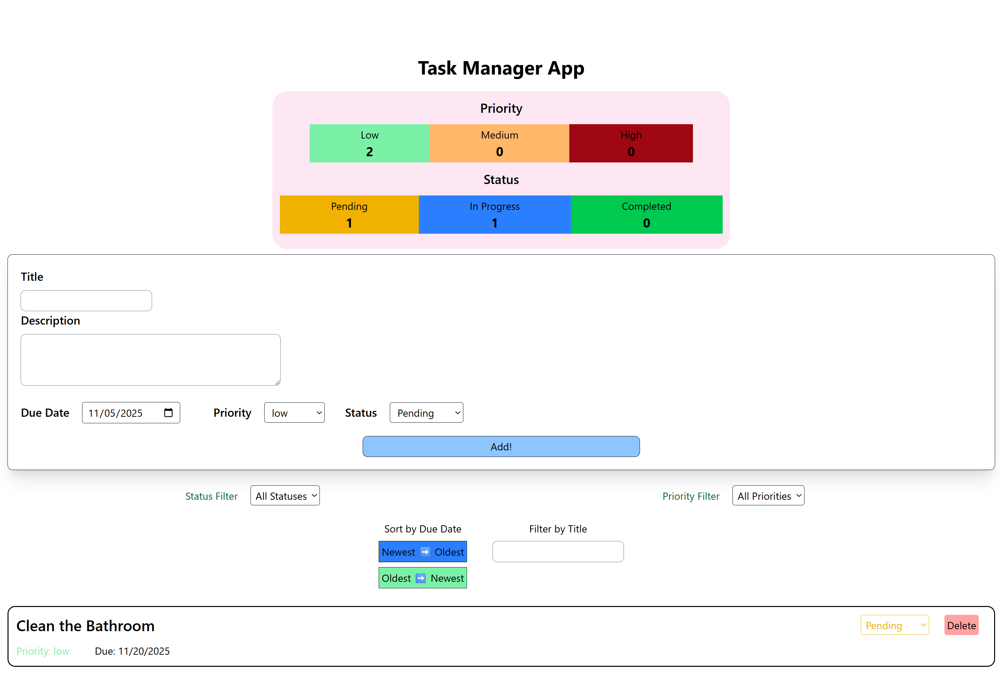

# Task Management Dashboard

This project is a React-based task management dashboard that utilizes React components and the useState hook. The core of the application is the Dashboard component, which integrates and manages all other components. It displays real-time statistics about task priority and status at the top of the page, updating dynamically as the user interacts with the tasks by adding, updating, or deleting them. The Dashboard serves as the central hub for managing task data, ensuring that all state changes are reflected consistently across the app.

The application features an interactive task form with built-in validation, triggered when the user submits the form. The title field must not be empty, and the due date cannot be set in the past. Once a task is successfully created, it is immediately reflected in the task list and the dashboard statistics.

Users can easily organize and manage tasks using the filtering and sorting features. The app provides dropdown menus for filtering tasks based on their status and priority. When a filter is selected, it is highlighted in blue to visually indicate that it is active. In addition to filtering, the user can sort tasks by their due dates, either from oldest to newest or in reverse order. The sorting button also turns blue when active, providing a clear indication of the current sorting state. A search bar allows users to quickly find tasks by matching the input text with task titles, making it simple to locate specific entries.

The Dashboard component connects all key parts of the application, including TaskFilter, TaskList, and TaskForm. TaskFilter handles filtering logic and communicates changes back to the Dashboard through callback functions. TaskList displays all tasks, renders each task’s interface using the TaskItem component, and provides controls for sorting and searching. TaskForm allows users to create new tasks and includes fields for title, description, due date, priority, and status. All these fields are managed through the formData state variable, ensuring controlled and reliable data input.

Overall, the Task Management Dashboard offers a clean and responsive interface for managing tasks, visualizing task statistics, and maintaining task priorities. The combination of real-time updates, intuitive filtering, and visual feedback creates a seamless and interactive user experience. Here is an example of how the app looks on the desktop: 

